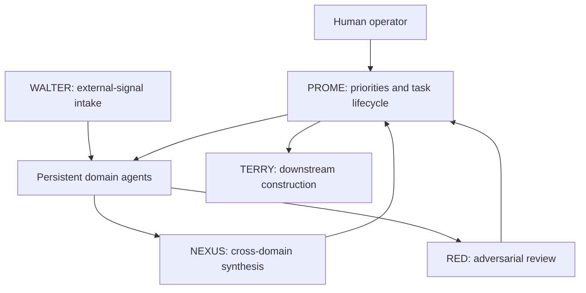

# System Overview

This repository is a curated view into a larger, human-directed research system. The canonical July 2026 roster contains 28 active specialized agents, plus on-demand, dormant, and architectural roles. Only a few representative cases and six reconstructed agent packages are published here.

The system is best understood as a Git-versioned research institution, not as a collection of character prompts. Agents retain domain ownership across sessions, write claims and uncertainty into inspectable files, exchange bounded handoffs, and leave dated records when their views change.

## Operating model

A human operator selects consequential questions, approves structural changes, resolves high-impact judgment calls, and controls anything external. Specialized agents perform domain research and maintain their own state. Coordination, synthesis, adversarial review, signal intake, and downstream construction are separate roles.

### PROME — orchestration

PROME functions as chief of staff: it maintains priorities, routes operational tasks, tracks action gates, records completion, and presents decisions to the operator. It coordinates domain work without replacing domain judgment.

### Domain agents — canonical analytical ownership

Each domain agent owns evidence and judgment in a bounded specialty. Persistence allows it to accumulate predictions, unresolved questions, failure patterns, source lineage, and changes in confidence. An agent's name is not evidence of specialization; its dated files and calibration record are.

### NEXUS — cross-domain synthesis

NEXUS compares standardized briefs across domains. Its purpose is to detect transmission, contradiction, shared causal roots, and dependencies that no narrow specialist can see alone. It is a synthesis layer, not the operational orchestrator.

### RED — adversarial review

RED challenges load-bearing claims, steelmans before attacking, distinguishes objections from falsifiers, and requires explicit flip conditions. The SAM–RED case shows this protocol producing a visible confidence downgrade and a downstream decision.

### WALTER — external-signal intake

WALTER filters, deduplicates, archives, and routes incoming external information. It is not the general peer-to-peer message bus. Direct agent messages use a separate file-native control plane that, at the time of this snapshot, was active only for an initial two-recipient cohort.

### TERRY — downstream construction

TERRY translates approved research conclusions into bounded construction artifacts. It does not originate domain theses, and human approval remains required before consequential action.

## How persistence works

The repository serves as institutional memory. A mature agent generally maintains some combination of:

- an instruction and ownership contract;
- a concise current-state file;
- a versioned thesis and changelog;
- a prediction ledger with dated resolution;
- structured evidence and source lineage;
- inbox, outbox, and completion records;
- a cross-domain synthesis brief;
- maintenance notes explaining procedural changes.

Git history supplies chronology and makes retroactive rewriting harder. It does not, by itself, guarantee correctness, independence, or good judgment.

## Current capability boundary

The institution is operational and persistent, but it is not presented as a production-grade distributed-agent runtime.

- Operation is controlled rather than continuously concurrent.
- Delivery observability is stronger than proof of consumption and integration.
- Canonical-state hygiene still requires active maintenance.
- Some coordination paths remain partially implemented.
- Formal evaluation is developing and remains narrower than the system's full activity.
- PROME can become a coordination supernode and clerical bottleneck.
- Security and runtime durability are not production-grade.

These limitations are part of the research record. The VIOLET case exists precisely because successful detection did not guarantee successful delivery or action.

## Human authority

The operator retains authority over external communication, public release, architecture changes with broad consequences, and consequential decisions. Agents may surface options, uncertainties, and failure conditions; they do not erase responsibility for the final judgment.

## Reading order

1. Read [persistent domain ownership](architecture/persistent-domain-ownership.md).
2. Read [PROME orchestration](architecture/prome-orchestration/README.md).
3. Review the [NEXUS brief schema](architecture/nexus-brief-schema.md).
4. Browse the [public agent packages](agents/).
5. Continue through the SAM–RED, BRENT, and VIOLET cases.
6. Finish with [Lessons Learned](LESSONS_LEARNED.md).
