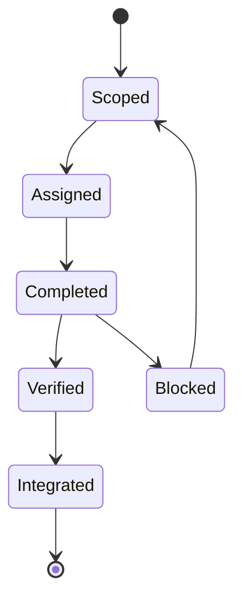

# PROME Orchestration

PROME is the operating layer that makes the published cases parts of one institution rather than isolated agent demonstrations.

## What PROME owns

- prioritization and task sequencing;
- operational routing and handoffs;
- action-gate registration and lifecycle;
- structured completion processing;
- operator-facing synthesis and decisions;
- architecture and state maintenance when explicitly in scope.

## What PROME does not own

- canonical analytical judgment inside a domain;
- cross-domain synthesis that belongs to NEXUS;
- external-signal filtering that belongs to WALTER;
- adversarial judgment that belongs to RED;
- consequential final authority, which remains human.

## The operating loop

A completion is not treated as integration merely because an agent produced output. PROME checks what changed, what remains unresolved, whether operator judgment is required, and which downstream owners need the result.

Action gates use an additional lifecycle. A gate can be live, fired but unexecuted, resolved, lapsed, or retired. The “fired but unexecuted” state is deliberately blocking: it exposes an orphaned obligation instead of allowing the system to proceed as if the action occurred.

See [Task Lifecycle](task-lifecycle.md) for the public reconstruction.

## Human approval gates

Internal reading, organization, and reversible maintenance may proceed within a bounded workstream. New research programs, protocol changes, broad structural changes, external communication, public release, and consequential actions require explicit human approval.

The purpose is not to remove judgment. It is to place judgment at named boundaries and preserve evidence about how the decision was reached.

## Design limitation: the coordination supernode

Central orchestration improves visibility but creates a bottleneck. If every message, clerical update, and routine routing decision requires PROME, high-value prioritization and synthesis compete with bookkeeping.

The system's ongoing design direction is therefore to automate or distribute mechanical obligations while keeping human-facing prioritization, exception handling, and consequential judgment explicit.
