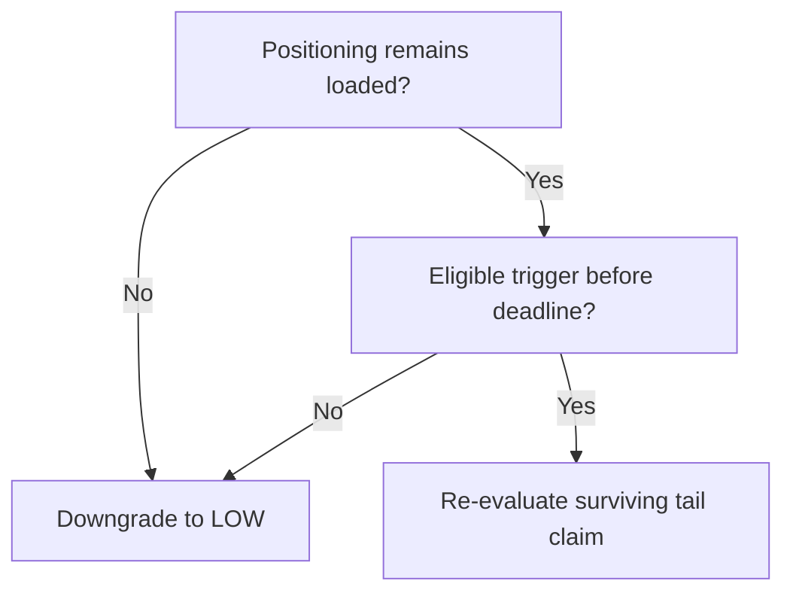

# From Dialogue to Falsification Window

The dialogue's main procedural achievement was converting a flexible tail narrative into a bounded conjunction.

## Internal logical form

The surviving thesis required both:

1. sufficient positioning fuel to remain; and
2. an eligible trigger to arrive inside a fixed window.

The thesis would downgrade if either condition failed.

## Why the window mattered

Without a deadline, each uneventful week could be reframed as additional fuel for a future move. The fixed window prevented that interpretation from continuing indefinitely.

The original internal record used precise market thresholds and an exact date. Because the deadline remained live when the public version was prepared, those operational details are withheld here. The following structural commitments are preserved:

- material unloading before a trigger caused a downgrade;
- no trigger by the fixed deadline caused the same downgrade;
- high positioning alone could not extend the deadline;
- reclaiming the higher confidence grade required a separate, predeclared strengthening condition;
- the dialogue's implementation gate inherited the lower confidence grade immediately.

## What can be evaluated publicly

The public artifact supports evaluation of whether the rules were explicit, logically coupled, and consequential. Final empirical grading of the still-live window belongs in a later, resolved-case update.
